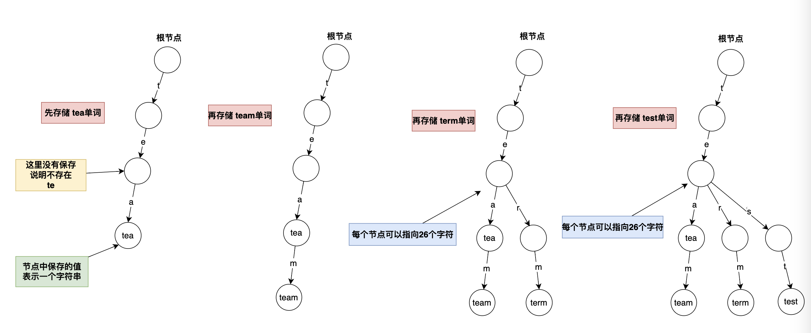
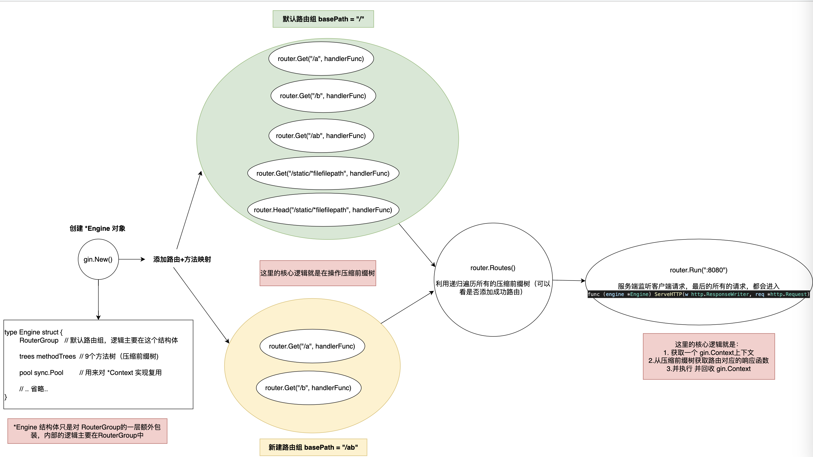
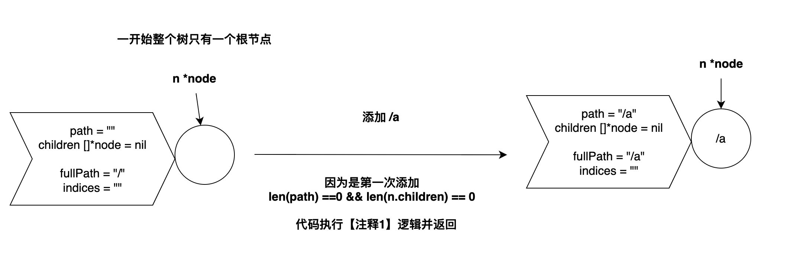
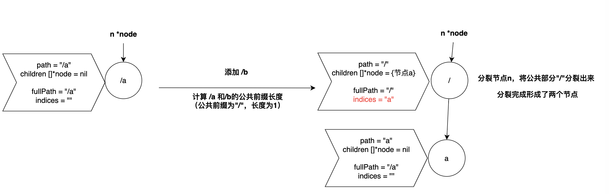
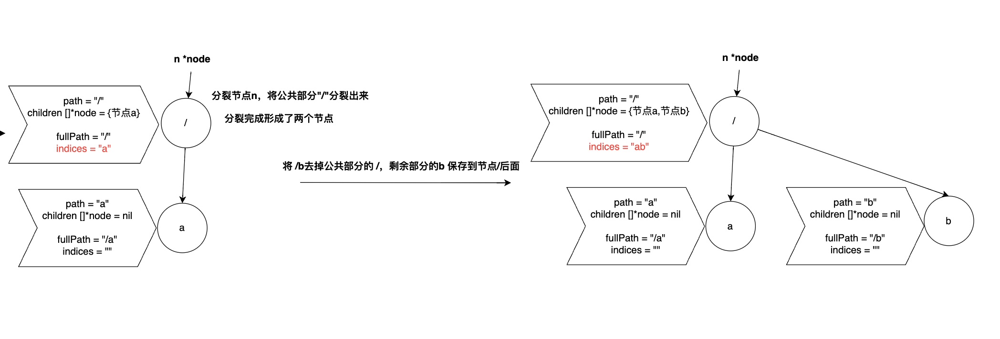
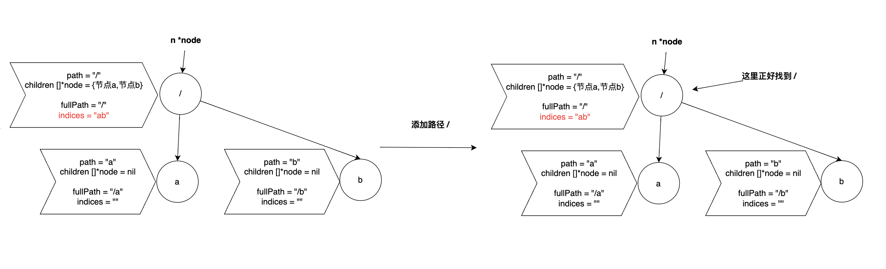
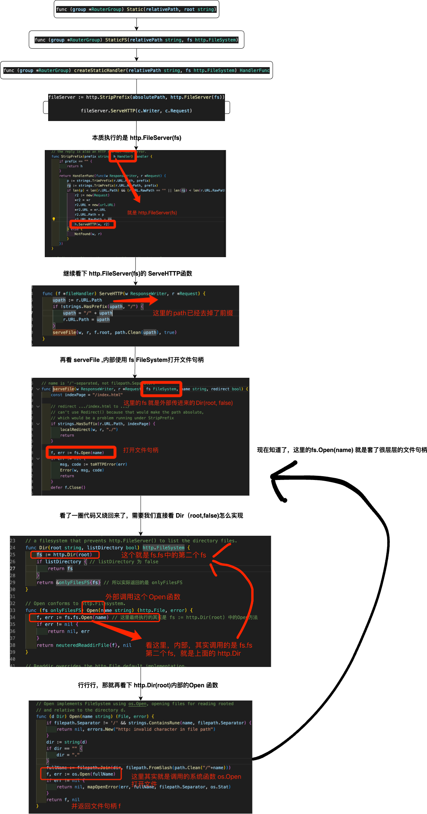

# Gin 源码阅读

本次的代码版本使用 v1.9.1

加了注释的`gin`代码地址： https://github.com/gofish2020/gin

演示范例代码路径  https://github.com/gofish2020/gin/examples


## 前置知识
`Gin`源码整体上逻辑还算简单，主要的逻辑就是围绕着**压缩前缀树**这个数据结构。如果从来没有听说过这个，问题不大，我们先一起了解下。

这里先简单说下**前缀树**是干什么的？本质就是用来做字符串匹配的。

比如有这么几个单词： `tea` `team` `term` `test`。如果我们要查找 `test`这个单词是否存在，那就要一个单词一个单词的比较，即可知道结果。那如果要查找 `eat`这个单词，很显然我们肉眼知道是不存在的，但是代码中也还是要一个个的比较才能知道。

那如何能快速的知道是否存在呢？
那就把这些单词存储形式调整下（不是一个个单词的保存），而是保存到树中（每一个字符就是一个树中的节点）。
如下图：


从上面的树结构可以发现，相同的前缀 `te`只存储了一份，不像一个个单词存储的时候，每个单词都保存了一份`te`，相对来说节约了存储空间（压缩前缀树可以进一步优化空间），那么这就是前缀树名字的由来。

当我们有了上面的这个多叉树的**根节点**，如果要查找 `eat`单词，从上图可知，根节点下面只有`t`字符，没有`e`字符，所以立刻就知道了`eat`不存在。

当我们要查找 `test`单词，从根节点，我们可以找到`t`,从`t`继续向下可以找到`e`,以此类推，顺着这个树我们可以找到并且存储着`test`字符串的节点。

这时如果我们要查找 `te` 单词，从根节点开始，可以顺利的找到 `t` 和 `e`两个字符，但是节点中并没有存储`te`字符串，所以`te`不存在。

`Leetcode`中正好有实现前缀树的算法题，大家可以尝试下 https://leetcode.cn/problems/implement-trie-prefix-tree/description/

算法答案如下：
```go
type Trie struct {
    next [26]*Trie // 26个字母（26叉树）
    isLast bool // 表示【当前节点】是不是字符串的最后一个字母
}

func Constructor() Trie {
   return Trie{}
}

// 保存字符串
func (this *Trie) Insert(word string)  {

    for _, w := range word { // 遍历字符串
        // 在树中判断字母
        node := this.next[ w -'a']
        if node == nil {
            node = new(Trie)
            this.next[w-'a'] = node
        }
        this = node // 让this指向新节点
    }

    this.isLast = true // 表示当前this最后指向的位置，就是字符串的最后一个字母
}

// 搜索字符串
func (this *Trie) Search(word string) bool {

    for _,w := range word {
        node := this.next[w-'a']
        if node == nil { // 说明没有找到字母
            return false
        }

        // 找到了，继续下一个字母
        this = node
    }
    // 例如 :先插入 apple ，然后搜索app，确实可以搜到，但是app不是有效的字符串（因为没有插入app)，只是恰好和apple的前半部分相同而已（就是要求完全匹配）
    return this.isLast
}

// 搜索前缀
func (this *Trie) StartsWith(prefix string) bool {
    for _,w := range prefix {
        node := this.next[w-'a']
        if node == nil { // 说明没有找到字母
            return false
        }
        // 找到了，继续下一个字母
        this = node
    }
    // 因为只是找前缀，并不是要求完全匹配
    return true
}
```

那么**压缩前缀树**是什么？

比如前面的公共前缀 `t` 和 `e` 这两个字符，完全可以一起保存为 `te`，不用分成两个单独的字符存储，如此不就又可以减少存储空间了嘛。（本质就是对前缀树存储空间上的更进一步的优化）

但是在具体的代码实现上比上面的前缀树要复杂些，我们还是以实际的`Gin`中的源码并结合图片的方式给大家讲解清楚。具体怎么实现的请看下面的源码阅读。


## 源码阅读


### 基本范例

在讲解源码之前先看下基本的使用范例，对`gin`有个大概的认知。
源码阅读也是围绕下面的函数展开。


```go
package main

import (
	"fmt"
	"net/http"

	"github.com/gofish2020/gin"
)

func handlerTest1(c *gin.Context) {
	c.String(http.StatusOK, c.Request.URL.Path)
}

func main() {
	// 初始化 *Engine 对象
	router := gin.New()

	router.GET("/a", handlerTest1)  // 路径 /a
	router.GET("/b", handlerTest1)  // 路径 /b
	router.GET("/", handlerTest1) // 路径 /

	// 这里相当于公共的前缀 /ab
	group := router.Group("/ab")
	{
		group.GET("/a", handlerTest1) // 路径 /ab/a
		group.GET("/b", handlerTest1) // 路径 /ab/b
	}
	// "/static" 表示访问的路由
	// "." 访问的文件在服务器的存储目录
	// 访问范例: http://127.0.0.1:8080/static/test.txt
	router.Static("/static", ".")

	// 遍历压缩前缀树
	list := router.Routes()
	for _, l := range list {
		fmt.Println(l.Method, l.Path)
	}

	// 启动服务
	router.Run(":8080")
}


```




### 函数阅读
下面的代码我会只保留重要的部分，不重要的部分会省略，便于大家看重点。
方法树就是压缩前缀树，直接用`methodTree`直译名字来称呼。

#### gin.New() 函数

`gin.New()`函数创建 `*Engine`对象；并且初始化了`RouterGroup` `trees` `pool` 三个对象。


```go
// *Engine的本质，其实是对 RouterGroup的额外包装，真正调用执行的方法，其实都是RouterGroup的
func New() *Engine { 
	
	engine := &Engine{
		RouterGroup: RouterGroup{
			Handlers: nil,
			basePath: "/",
			root:     true,
		},

		trees:                  make(methodTrees, 0, 9), // 9个方法树
	}
	engine.RouterGroup.engine = engine // 这里设定 engine 到 RouterGroup中；相当于 engine中可以知道RouterGroup，同时RouterGroup 可以知道engine。相互引用的效果。
	engine.pool.New = func() any {     // 用池子，来复用 *Context 对象
		return engine.allocateContext(engine.maxParams)
	}
	return engine
}

```

> 疑问点：为什么 `trees` 这个切片的大小是 9？

可以看下这个库文件 `/net/http/method.go`，因为标准的 `http`请求方法就是9种

```go
package http

// Common HTTP methods.
//
// Unless otherwise noted, these are defined in RFC 7231 section 4.3.
const (
	MethodGet     = "GET"
	MethodHead    = "HEAD"
	MethodPost    = "POST"
	MethodPut     = "PUT"
	MethodPatch   = "PATCH" // RFC 5789
	MethodDelete  = "DELETE"
	MethodConnect = "CONNECT"
	MethodOptions = "OPTIONS"
	MethodTrace   = "TRACE"
)
```

> `methodTrees`结构体

本质就是一个切片，而且切片的每个子元素类型为 `methodTree`
-  `method string`保存请求的方式（例如`GET/POST/HEAD/DELETE`等）
-  `root *node` 就是 该请求方法对应的压缩前缀树的**根节点**

```go
type methodTree struct {
	method string
	root   *node
}

// 方法树对象：本质就是个切片
type methodTrees []methodTree

func (trees methodTrees) get(method string) *node {

	// 因为是切片，所以需要遍历的方式，查找 method 是否存在
	for _, tree := range trees {
		if tree.method == method {
			return tree.root
		}
	}
	return nil // 不存在返回nil
}
```


#### router.GET() 函数
上面的 `New()`函数创建好了 `*Engine`对象，接下来就要使用该对象`router.GET()`添加路由了。

进入 `router.GET()`函数可以看到，我们虽然表面上调用的 `*Engine`对象的 `GET()`函数，但是实际上是 `RouterGroup.GET()` 函数。

```go

// 因为这种声明方式
type Engine struct {
	RouterGroup
    
}

func (group *RouterGroup) GET(relativePath string, handlers ...HandlerFunc) IRoutes {
	return group.handle(http.MethodGet, relativePath, handlers)
}


func (group *RouterGroup) POST(relativePath string, handlers ...HandlerFunc) IRoutes {
	return group.handle(http.MethodPost, relativePath, handlers)
}

```

然后继续进入 `group.handle`函数内部

- 拼接 `group.basePath + relativePath`
- 拼接 `group.Handlers + handlers HandlersChain`
- 【重点】`group.engine.addRoute` 在方法树上添加 【路径】 和 【路径的处理函数】

```go

func (group *RouterGroup) handle(httpMethod, relativePath string, handlers HandlersChain) IRoutes {
	// 拼接 group.basePath + relativePath
	absolutePath := group.calculateAbsolutePath(relativePath)
	// 将 group.Handlers + handlers HandlersChain合并到一起，作为一个 HandlersChain
	handlers = group.combineHandlers(handlers)
	// 在方法树上添加 【路径】 和 【路径的处理函数】
	group.engine.addRoute(httpMethod, absolutePath, handlers)
	return group.returnObj()
}


// 拼接 basePath + relativePath
func (group *RouterGroup) calculateAbsolutePath(relativePath string) string {
	return joinPaths(group.basePath, relativePath)
}


func (group *RouterGroup) combineHandlers(handlers HandlersChain) HandlersChain {
	finalSize := len(group.Handlers) + len(handlers)
	// 这里的 abortIndex 固定值 63，意思就是 group.Handlers + handlers HandlersChain 的函数切片最多只能有62个
	assert1(finalSize < int(abortIndex), "too many handlers")
	mergedHandlers := make(HandlersChain, finalSize)
	copy(mergedHandlers, group.Handlers)                 // 将 group中的 Handlers
	copy(mergedHandlers[len(group.Handlers):], handlers) // 拼接上 handlers HandlersChain
	return mergedHandlers
}
```

这里重点看下 `group.engine.addRoute`函数内部逻辑

- 对 `path` `method` `handlers`做前置校验
- 基于 `method string` 从 ` engine.trees.get`获取该方法对应的压缩前缀树的根节点（不存在，就是创建一个新的根节点）
- 【重点】`root.addRoute(path, handlers)`在前缀树中存储 `path` 和 `handlers`

```go
// 在方法树中，添加 path 和 处理方法 handlers 之间的映射关系（注意： handlers是个方法切片，即一个path 对应一组处理方法）
func (engine *Engine) addRoute(method, path string, handlers HandlersChain) {

	// 要求 path第一个字符必须是 /
	assert1(path[0] == '/', "path must begin with '/'")
	// 要求 请求method不能为空
	assert1(method != "", "HTTP method can not be empty")
	// 要求 切片不能为空
	assert1(len(handlers) > 0, "there must be at least one handler")

	debugPrintRoute(method, path, handlers)

	// 从trees切片中，获取 method对应的树的根节点
	root := engine.trees.get(method)
	if root == nil { // 不存在

		// 创建根节点
		root = new(node)
		root.fullPath = "/"
		// 并保存到 trees中
		engine.trees = append(engine.trees, methodTree{method: method, root: root}) // 创建新的方法树
	}

	// 将 路径 + 该路径对应的处理函数，保存到方法树中（这里就是压缩前缀树的存储逻辑）
	root.addRoute(path, handlers)

	// 计算参数个数（也就是 : 和 * 开头的字符串个数）
	if paramsCount := countParams(path); paramsCount > engine.maxParams {
		engine.maxParams = paramsCount
	}

	// 计算path由几个部分组成（也就是 / 的个数）
	if sectionsCount := countSections(path); sectionsCount > engine.maxSections {
		engine.maxSections = sectionsCount
	}
}
```


进入`root.addRoute(path, handlers)`函数内部，看下压缩前缀树是怎么存储字符串的 

代码注释很清晰，但是如果第一次看估计有点晕。以添加 `/a /b /`这三个路径为例图示讲解下`root.addRoute`函数逻辑。(**建议先看代码，再配合图理解**)

```go
router.GET("/a", handlerTest1) // 路径 /a
router.GET("/b", handlerTest1) // 路径 /b
router.GET("/", handlerTest1)  // 路径 /
```

> 向压缩前缀树中添加【 路径/a】

因为第一次添加，所以直接将路径`/a`保存到根节点中【代码注释1逻辑】


>  向压缩前缀树中添加【 路径 /b】

因为此时树的根节点已经保存了 `/a`（即 `n.path`的值），所以树就不是空树了。

此时进入`for`循环执行`longestCommonPrefix`函数【代码注释2逻辑】，求 `n.path`（即 /a）和 `path`（即 /b）的公共前缀长度，/a和/b的公共前缀为`/`,长度为1， 1的值小于 `n.path`（即 /a）的长度2，就需要将n指向的根节点分裂,将公共部分分裂出来（分裂为： / 和 a）【代码注释3逻辑】，这样等价于就把/a和/b两个字符串的公共部分`/`给分裂了出来。



此时只是完成了根节点的分裂，但是 /b 还没有保存进去。【代码注释4逻辑】
公共前缀的长度1 小于 `path`（即/b）的长度2，前面的分裂已经有了公共的前缀`/`节点，那么只需要将剩余的"b"放到 "/"节点后面不就可以了。

这个里面还有一个额外的逻辑，如果 / 节点后面，之前已经存在了 b开头的节点，会让n直接指向这个子节点，然后代码`continue walk`，让 n指向的b开头的节点 和 `path`（注意这里的path只剩下了b字符`path = path[i:]`）重复`for`循环的逻辑。




> 向压缩前缀树中添加【 路径 /】

(每次插入路径都是从根节点开始）前面的根节点已经分裂出了 / 节点，此时和路径 / 比较，他们的公共前缀长度为1（即等于 n.path长度，也等于 path长度】，所以代码逻辑直接执行【代码注释5】，也就是n节点匹配到了字符串的尾部。




下面就是加了注释的代码（**建议配合上面的添加过程阅读**）

`node`结构体定义
```go
// 整个数据结构 就是一个多叉树
type node struct {
	path      string //  当前节点表示的【字符串值】
	indices   string // 当前节点下面的所有的子节点中的path值的首字母（用于快速判断，有哪些子节点）
	wildChild bool
	nType     nodeType
	priority  uint32        // 优先级，排序使用
	children  []*node       // 子节点 child nodes, at most 1 :param style node at the end of the array
	handlers  HandlersChain // 对应的处理函数
	fullPath  string        // 从根节点到达当前节点完整字符串
}
```
> 疑问点： `indices`是干啥的？

举个例子：比如有个节点`a`，他的子节点有个 `boy` `girl` `man`,会在节点`a`的`indices`记录子节点的首字母（即:`bgm`),这样如果我们要查找节点`a`下面的子节点 `woman`,通过`bgm`这串字符串可知，里面没有`w`字母，都不用查看子节点了。

```go


// 最长公共前缀长度
func longestCommonPrefix(a, b string) int {
	i := 0
	max := min(len(a), len(b))    // 两个字符串的最小的长度
	for i < max && a[i] == b[i] { // 从头部开始，比较字符串，找到相同的部分
		i++
	}
	return i // 表示相同部分的长度
}

// addRoute adds a node with the given handle to the path.
// Not concurrency-safe!

// 不是并发安全
func (n *node) addRoute(path string, handlers HandlersChain) {

	// path保存到fullPath中
	fullPath := path
	n.priority++

	// 【注释1】第一次执行addRoute函数，path 和 children 肯定都是没有值（即：这棵树是一个没有任何数据的空树）
	// Empty tree
	if len(n.path) == 0 && len(n.children) == 0 {

		// 只看没有通配符的情况，相当于直接将path/fullPath/handlers保存到 n *node中
		n.insertChild(path, fullPath, handlers)
		n.nType = root
		return
	}

	parentFullPathIndex := 0

walk:
	for {
		// Find the longest common prefix.
		// This also implies that the common prefix contains no ':' or '*'
		// since the existing key can't contain those chars.

		// 【注释2】 获取 path 和 n.path 的公共部分的长度
		i := longestCommonPrefix(path, n.path)

		// Split edge
		// 【注释3】（分裂节点） 比如 n.path = /a path = /b ,两个的公共前缀就只有 /，此时的n.path会分裂为 / 和 一个子节点 a
		if i < len(n.path) {
			// 相当于分裂节点n，将 n.path[i:]这部分分裂出来（即：a），形成了一个新的child节点
			child := node{
				path:      n.path[i:], // child节点分裂出来的部分（也就是/a 分裂出来的a）
				wildChild: n.wildChild,
				nType:     static,
				indices:   n.indices,  // 继承父的indices
				children:  n.children, // 继承父的所有的子节点
				handlers:  n.handlers,
				priority:  n.priority - 1,
				fullPath:  n.fullPath, // 继承父亲
			}

			// 分裂出来的child节点，成了当前节点n的子节点
			n.children = []*node{&child}
			// []byte for proper unicode char conversion, see #65
			n.indices = bytesconv.BytesToString([]byte{n.path[i]}) // 相当于将child节点中path的第一个字符，提取出来保存到，当前节点n的indices中（可以快速的判断当前节点n后面跟了哪些子节点）
			n.path = path[:i]                                      // 当前节点剩下的公共部分（即 /）
			n.handlers = nil                                       // 因为已经遗传给了child，自己就变成了nil
			n.wildChild = false
			n.fullPath = fullPath[:parentFullPathIndex+i] // 当前节点n表示的全路径（原来是 /a,现在是/)
		}

		// Make new node a child of this node

		//【注释4】
		// 当 n.path = /a , path = /b 上面的if条件先执行，形成了当前节点为/ 和子节点为a的情况
		// 执行到这里，i 也是小于 len(path)，因为当前节点已经有了 / ，那么我们只需要将字符b当作和子节点a一样，也放到 / 后面不就形成了 b子节点
		if i < len(path) {
			path = path[i:] // 这里相当于截取出了 b，并更新path
			c := path[0]    // 同时将第一个字符也提取出来 ,就是字符b

			// '/' after param
			if n.nType == param && c == '/' && len(n.children) == 1 {
				parentFullPathIndex += len(n.path)
				n = n.children[0] // 相当于 n 的指向 向下移动了一下
				n.priority++
				continue walk
			}

			// Check if a child with the next path byte exists

			// 这里检查当前节点n后面，是否已经存在以 b字符开头的子节点
			for i, max := 0, len(n.indices); i < max; i++ {
				if c == n.indices[i] { // 找到了，以 b字符 开头的child节点
					parentFullPathIndex += len(n.path)
					i = n.incrementChildPrio(i) // 调整子节点的优先级
					n = n.children[i]           // 如果存在，那就让 n 指向这个 child节点
					continue walk               // 继续重复公共部分查找
				}
			}

			// Otherwise insert it
			// 执行到这里，说明 当前节点n后面没有以 b字符开始的子节点
			if c != ':' && c != '*' && n.nType != catchAll {
				// []byte for proper unicode char conversion, see #65
				n.indices += bytesconv.BytesToString([]byte{c}) // 将 b字符 拼接到 n.indices 中

				// 同时创建一个新的child节点
				child := &node{
					fullPath: fullPath,
				}
				n.addChild(child)                        // 将child节点放置到 当前n节点的n.children中
				n.incrementChildPrio(len(n.indices) - 1) // 相当于将频繁使用的子节点，调整位置
				n = child                                // 然后 n 指向 这个child节点
			} else if n.wildChild {
				// inserting a wildcard node, need to check if it conflicts with the existing wildcard
				n = n.children[len(n.children)-1]
				n.priority++

				// Check if the wildcard matches
				if len(path) >= len(n.path) && n.path == path[:len(n.path)] &&
					// Adding a child to a catchAll is not possible
					n.nType != catchAll &&
					// Check for longer wildcard, e.g. :name and :names
					(len(n.path) >= len(path) || path[len(n.path)] == '/') {
					continue walk
				}

				// Wildcard conflict
				pathSeg := path
				if n.nType != catchAll {
					pathSeg = strings.SplitN(pathSeg, "/", 2)[0]
				}
				prefix := fullPath[:strings.Index(fullPath, pathSeg)] + n.path
				panic("'" + pathSeg +
					"' in new path '" + fullPath +
					"' conflicts with existing wildcard '" + n.path +
					"' in existing prefix '" + prefix +
					"'")
			}

			// 修改 n 节点中的 path, fullPath, handlers 三个值（这里的n其实就上child）
			n.insertChild(path, fullPath, handlers)
			return
		}

		// 【注释5】执行到这里，说明 【公共前缀的长度】 和 【path 的长度相同】：例如 n.path = /a , path = / 经过上面的逻辑 n.path 分裂为 / 和  子节点a，此时n指向的/位置，就是我们要找到的位置
		// Otherwise add handle to current node
		if n.handlers != nil { // 前提，当前位置没有被重复注册
			panic("handlers are already registered for path '" + fullPath + "'")
		}
		n.handlers = handlers
		n.fullPath = fullPath
		return
	}
}

```

简单总结下：

- 刚开始添加路径 `/a` 的时候，因为是第一次添加，直接保存到根节点中
- 添加路径 `/b` 的时候，先看下n指向的根节点的 `n.path` 和 `path`的公共前缀，目的在于判定n指向的节点需不需要进行拆分；如果 `i < len(n.path)`,说明需要拆分；否则就保持n不变；继续判断 i 和 path的长度关系，如果 `i < len(path)`，说明 path也需要拆分，将 `path[i:]` 剩下的字符串，作为子节点保存到 n 节点的后面
- 添加路径 / 的时候，因为根节点的 `n.path`值和`path`值正好完全重叠，表示匹配到了最终的位置。


#### router.Group 函数

新创建一个 `*RouterGroup`对象，并且其中的 `Handlers` `basePath`的值是由 当前的 `group *RouterGroup`中的值叠加而来。（新对象属性是老对象属性的基础上叠加而来）

```go
// 在现有 group的基础上，新创建一个*RouterGroup
func (group *RouterGroup) Group(relativePath string, handlers ...HandlerFunc) *RouterGroup {

	// 创建了一个新的 *RouterGroup对象
	// 而且 新 *RouterGroup对象的Handlers/basePath值，叠加了当前的group *RouterGroup的现有的值
	return &RouterGroup{
		Handlers: group.combineHandlers(handlers),
		basePath: group.calculateAbsolutePath(relativePath),
		engine:   group.engine,
	}
}

```


#### router.Static 函数

指定静态文件的存储路径

```go
router.Static("/static", ".")
```

代码含义：
- 当用户访问 `http://127.0.0.1:8000/static/test.txt`服务端会提取出路由`/static/test.txt`，并且去掉`/static/`只保留 `test.txt`;
- 然后去服务端 `.`目录下查找`test.txt`，并将内容回显给客户端。


底层实现：

- `Static`函数内部其实在调用 `StaticFS`函数
- 在 `StaticFS`函数内部，调用 `GET` `HEAD`方法，在方法树中添加路由 + 处理函数的映射
-  比较复杂的是 `createStaticHandler`函数，代码逻辑套了很多层次，按照我的代码注释一层层的看进去可知，最后调用`fs := http.Dir(root) 中的Open方法`打开文件句柄，最后在 `serveContent`函数中执行 `io.CopyN(w, sendContent, sendSize)`发送数据给客户端。

（为了便于理解下面有图片，讲解流程）


```go

func (group *RouterGroup) Static(relativePath, root string) IRoutes {
	return group.StaticFS(relativePath, Dir(root, false))
}

func (group *RouterGroup) StaticFS(relativePath string, fs http.FileSystem) IRoutes {
	if strings.Contains(relativePath, ":") || strings.Contains(relativePath, "*") {
		panic("URL parameters can not be used when serving a static folder")
	}

	// 路由对应的处理函数
	handler := group.createStaticHandler(relativePath, fs)
	// 路由
	urlPattern := path.Join(relativePath, "/*filepath")

	// Register GET and HEAD handlers
	group.GET(urlPattern, handler) // 将路由 + 对应的处理函数 保存到方法树中
	group.HEAD(urlPattern, handler)
	return group.returnObj()
}


func (group *RouterGroup) createStaticHandler(relativePath string, fs http.FileSystem) HandlerFunc {
	absolutePath := group.calculateAbsolutePath(relativePath)
	// StripPrefix 会去掉 r.URL.Path 中的前缀 absolutePath，后续从 r.URL.Path 获取文件路径的时候，就不会有前缀
	fileServer := http.StripPrefix(absolutePath, http.FileServer(fs))
	return func(c *Context) {
		if _, noListing := fs.(*onlyFilesFS); noListing {
			c.Writer.WriteHeader(http.StatusNotFound)
		}

		// 从 url 中提取出 文件路径
		file := c.Param("filepath")
		// Check if file exists and/or if we have permission to access it
		f, err := fs.Open(file) // 判断文件是否存在（文件路径：就是在 StaticFS 中设定的root string + 从url取出的路径，即为在服务器中的文件路径）
		if err != nil {
			c.Writer.WriteHeader(http.StatusNotFound)
			c.handlers = group.engine.noRoute
			// Reset index
			c.index = -1
			return
		}
		f.Close()
		// fileServer.ServeHTTP 函数,实际执行的是 http.FileServer(fs).ServeHTTP 函数,
		// 而在http.FileServer(fs).ServeHTTP 内部，会执行serveFile函数
		// 再看 serveFile函数内部，实际执行的 fs.Open(name)，而 fs 就是 Dir(root, false)
		// 所以直接看 Dir(root, false)， 最终执行的其实是 fs := http.Dir(root) 中的Open方法
		fileServer.ServeHTTP(c.Writer, c.Request)
	}
}

```



最后我们在 `serveFile`函数中代码拉到最后，看到有一行 `serveContent(w, r, d.Name(), d.ModTime(), sizeFunc, f)` 函数，这里就是将 `f`句柄对应的文件发送出去,进入`serveContent`函数再拉去到函数底部`io.CopyN(w, sendContent, sendSize)`就是真正的发送。


#### Routes 函数

就是多叉树的前序遍历；

遍历的过程中判断节点中的`root.handlers`是否 `> 0`，说明节点是一个有效的路由的尾部节点

```go
func (engine *Engine) Routes() (routes RoutesInfo) {
	for _, tree := range engine.trees { // 遍历所有的方法树
		routes = iterate("", tree.method, routes, tree.root) // 针对每一个方法树，使用深度递归的方式，从根节点开始，查找每棵树中的路径
	}
	return routes
}

// 递归的遍历整个多叉树（前序遍历）
func iterate(path, method string, routes RoutesInfo, root *node) RoutesInfo {
	// 累计拼接路径
	path += root.path
	// 判断是否有响应函数。 有，说明当前节点是一个有效的路由值
	if len(root.handlers) > 0 {
		handlerFunc := root.handlers.Last()
		routes = append(routes, RouteInfo{
			Method:      method,
			Path:        path,
			Handler:     nameOfFunction(handlerFunc),
			HandlerFunc: handlerFunc,
		})
	}
	// 继续查看 当前的节点的所有的子节点
	for _, child := range root.children {
		routes = iterate(path, method, routes, child)
	}
	return routes
}
```

#### Run 函数

这个`Run`函数执行后，服务端正式启动，并监听在`8080`端口等待请求到来

```go
func (engine *Engine) Run(addr ...string) (err error) {
	defer func() { debugPrintError(err) }()

	if engine.isUnsafeTrustedProxies() {
		debugPrint("[WARNING] You trusted all proxies, this is NOT safe. We recommend you to set a value.\n" +
			"Please check https://pkg.go.dev/github.com/gofish2020/gin#readme-don-t-trust-all-proxies for details.")
	}

	address := resolveAddress(addr)
	debugPrint("Listening and serving HTTP on %s\n", address)
	err = http.ListenAndServe(address, engine.Handler()) // 【注意】第二个参数一般情况下为nil，这里相当使用我们自己的Hander
	return
}

```

一旦请求到来后，所有的请求都会执行 `engine.ServeHTTP`函数(这里涉及 `net/http`库的底层实现原理，待补充)

```go
// ServeHTTP conforms to the http.Handler interface.
func (engine *Engine) ServeHTTP(w http.ResponseWriter, req *http.Request) {

	// 从对象池中获取一个 *Context
	c := engine.pool.Get().(*Context)

	// 将 w 和req 保存到 *Context中
	c.writermem.reset(w)
	c.Request = req
	c.reset()

	// 基于请求的信息，在方法树中，查询出路由对应的响应函数，并且执行
	engine.handleHTTPRequest(c)

	// 用完放回池子
	engine.pool.Put(c)
}

```

- 从`c.Request`中提取出 请求方法 + 路由；
- 从 `root.getValue`函数中查找对应的响应函数，并保存到 上下文`*Context`中
- 调用 `c.Next()`函数，顺序执行上下文中的所有的响应函数

```go
func (engine *Engine) handleHTTPRequest(c *Context) {
	// 请求方法
	httpMethod := c.Request.Method
	// 请求路由
	rPath := c.Request.URL.Path
	unescape := false
	if engine.UseRawPath && len(c.Request.URL.RawPath) > 0 {
		rPath = c.Request.URL.RawPath
		unescape = engine.UnescapePathValues
	}

	if engine.RemoveExtraSlash { // 去掉多余的 /
		rPath = cleanPath(rPath)
	}

	// Find root of the tree for the given HTTP method
	t := engine.trees // 方法树
	for i, tl := 0, len(t); i < tl; i++ {
		if t[i].method != httpMethod {
			continue
		}

		// 执行到这里，说明找到了当前请求方法对应的方法树
		root := t[i].root
		// Find route in tree
		value := root.getValue(rPath, c.params, c.skippedNodes, unescape) // 从方法树中找到路由对应的 处理函数

		// 将 value中的值，都保存到 *Context中
		if value.params != nil {
			c.Params = *value.params
		}
		if value.handlers != nil {
			c.handlers = value.handlers
			c.fullPath = value.fullPath
			c.Next() // 执行方法（顺序执行 c.handlers中的所有的函数方法）
			c.writermem.WriteHeaderNow()
			return
		}
		if httpMethod != http.MethodConnect && rPath != "/" {
			if value.tsr && engine.RedirectTrailingSlash {
				redirectTrailingSlash(c)
				return
			}
			if engine.RedirectFixedPath && redirectFixedPath(c, root, engine.RedirectFixedPath) {
				return
			}
		}
		break
	}

	// 当HandleMethodNotAllowed = true 表示：当前的 httpMethod 方法不存在，看下是否允许其他的请求方法，并将结果通过 Allow告知前端
	if engine.HandleMethodNotAllowed {
		// According to RFC 7231 section 6.5.5, MUST generate an Allow header field in response
		// containing a list of the target resource's currently supported methods.
		allowed := make([]string, 0, len(t)-1)
		for _, tree := range engine.trees {
			if tree.method == httpMethod {
				continue
			}
			if value := tree.root.getValue(rPath, nil, c.skippedNodes, unescape); value.handlers != nil {
				allowed = append(allowed, tree.method)
			}
		}
		if len(allowed) > 0 {
			c.handlers = engine.allNoMethod
			c.writermem.Header().Set("Allow", strings.Join(allowed, ", "))
			serveError(c, http.StatusMethodNotAllowed, default405Body)
			return
		}
	}

	// 如果上面的没有对应的路由，直接返回404
	c.handlers = engine.allNoRoute
	serveError(c, http.StatusNotFound, default404Body)
}

```

这里截取一部分的`getValue`函数逻辑，介绍下是怎么匹配字符串的。

就是用 `path` 和 每个节点的 `n.path` 进行对比，将 `n.path` 和 `path` 相同的前缀部分去掉，然后剩下 `path[len(prefix):]`继续和**子节点** `n.path`进行匹配，直到剩下`path`和某个节点的 `n.path` **完全相同**，说明找到了，把里面的响应函数提取出来，保存到 `nodeValue`中返回。

```go
func (n *node) getValue(path string, params *Params, skippedNodes *[]skippedNode, unescape bool) (value nodeValue) {
	var globalParamsCount int16

walk: // Outer loop for walking the tree
	for {
		prefix := n.path             // 当前 节点n中的n.path的值
		if len(path) > len(prefix) { // 如果 要查找的 path > n.path, 说明需要继续向下查找
			if path[:len(prefix)] == prefix {
				path = path[len(prefix):] // 去掉path中的前缀，剩下的字符串，继续从当前n节点，向子节点查找

				// Try all the non-wildcard children first by matching the indices
				idxc := path[0]
				for i, c := range []byte(n.indices) { // 查找 当前节点n的所有的子节点，（是否有 idxc开头的子节点）
					if c == idxc { // 如果找到了，子节点
						//  strings.HasPrefix(n.children[len(n.children)-1].path, ":") == n.wildChild
						if n.wildChild {
							index := len(*skippedNodes)
							*skippedNodes = (*skippedNodes)[:index+1]
							(*skippedNodes)[index] = skippedNode{
								path: prefix + path,
								node: &node{
									path:      n.path,
									wildChild: n.wildChild,
									nType:     n.nType,
									priority:  n.priority,
									children:  n.children,
									handlers:  n.handlers,
									fullPath:  n.fullPath,
								},
								paramsCount: globalParamsCount,
							}
						}

						n = n.children[i] // 让n指向 子节点，继续匹配剩下的path
						continue walk
					}
				}
		}

		// 说明当前的节点的n.path的值和 要找的path相同
		if path == prefix {
			// If the current path does not equal '/' and the node does not have a registered handle and the most recently matched node has a child node
			// the current node needs to roll back to last valid skippedNode
			if n.handlers == nil && path != "/" {
				for length := len(*skippedNodes); length > 0; length-- {
					skippedNode := (*skippedNodes)[length-1]
					*skippedNodes = (*skippedNodes)[:length-1]
					if strings.HasSuffix(skippedNode.path, path) {
						path = skippedNode.path
						n = skippedNode.node
						if value.params != nil {
							*value.params = (*value.params)[:skippedNode.paramsCount]
						}
						globalParamsCount = skippedNode.paramsCount
						continue walk
					}
				}
				//	n = latestNode.children[len(latestNode.children)-1]
			}
			// We should have reached the node containing the handle.
			// Check if this node has a handle registered.
			if value.handlers = n.handlers; value.handlers != nil { // 并且 n节点中的handlers中是有注册处理函数的
				value.fullPath = n.fullPath
				return value
			}

			
		}
	}
}

```


### 待补充

当服务器调用`Run`启动以后，怎么就执行到 `engine.ServeHTTP`函数了呢。这块是关于`net/http`网络库的底层实现，我会再写一篇文件介绍。